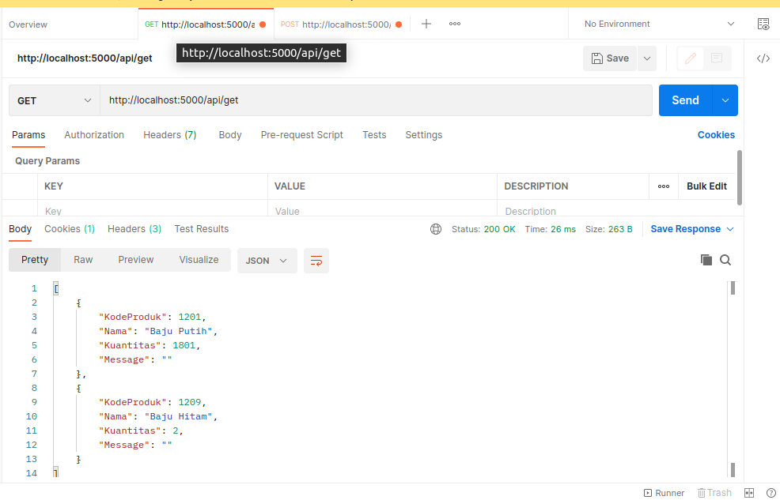
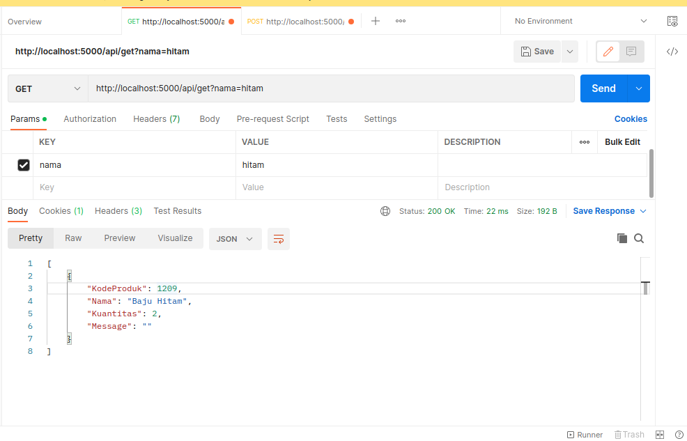
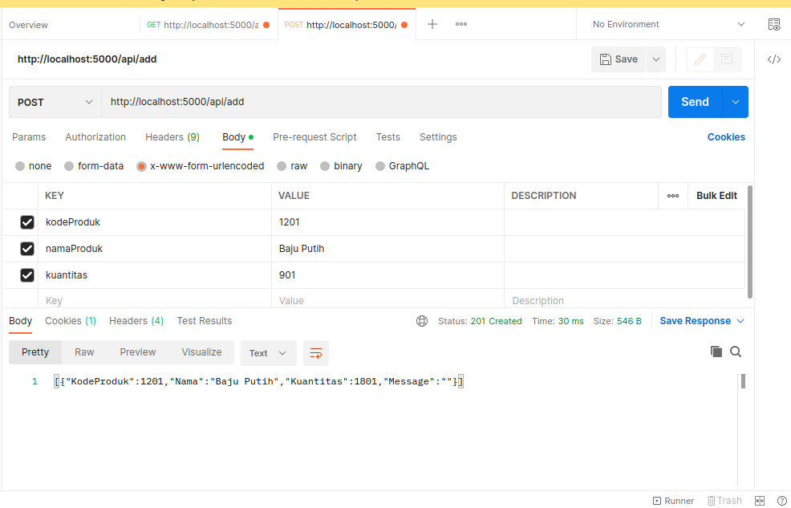
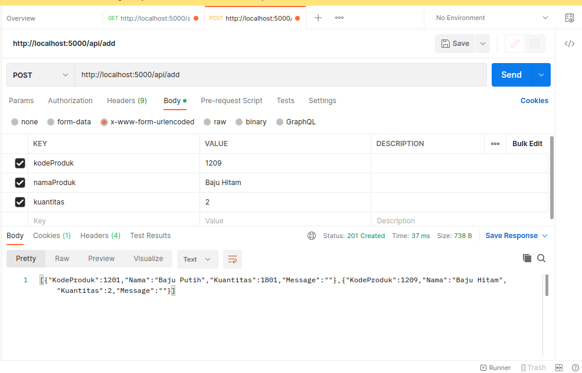
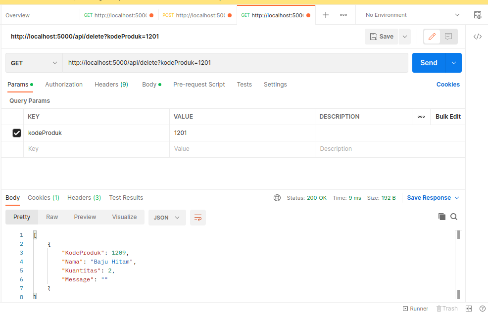

# Command to run server

Command to file

```
go run cart.go

```

# For API Documentation


## Get All


## Filter By Name


## Filter By Name


## Add produk
### First Add


### Second Add



## Add qty produk


## delete produk



for more documentation please click link below

https://documenter.getpostman.com/view/9500319/2s8ZDU4iQM